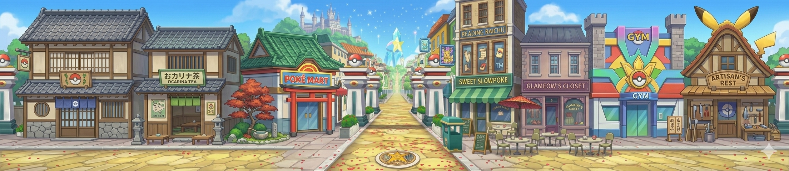
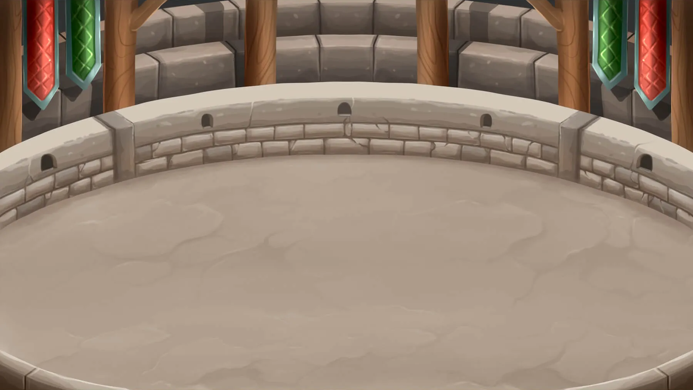
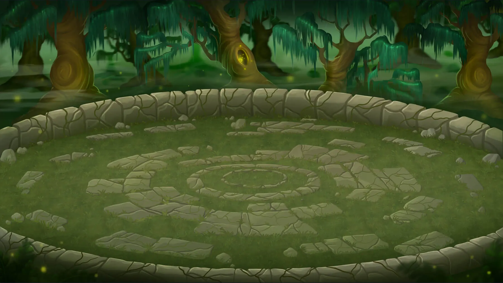
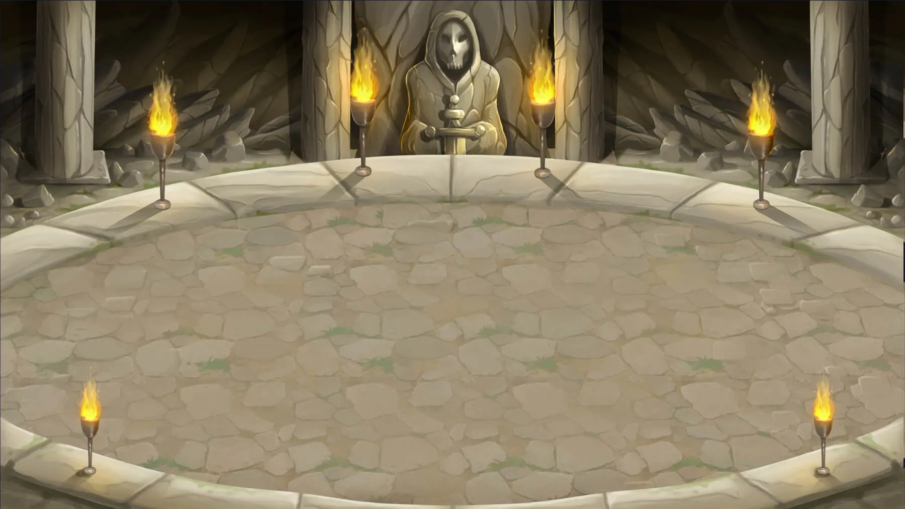
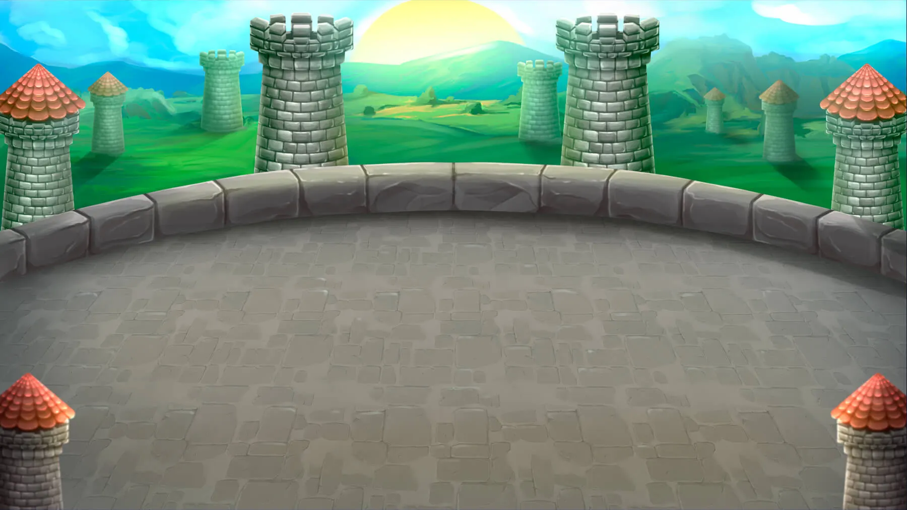
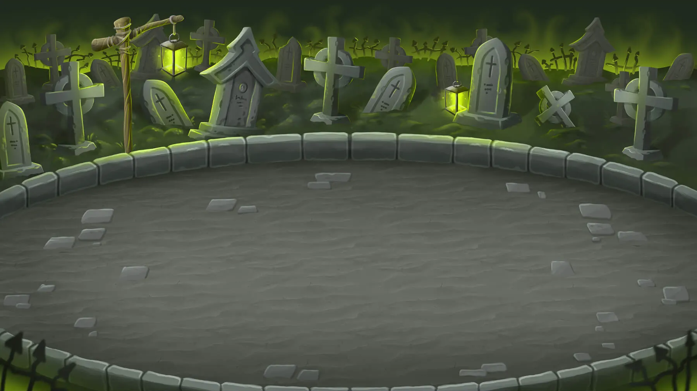
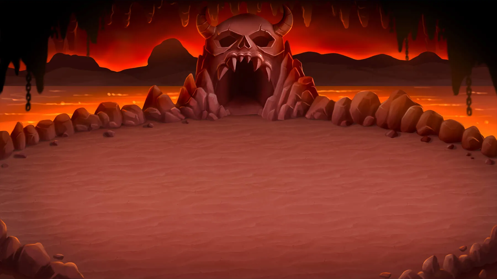

<div align="center">

# ⚡ Forge: Monster Vault

### _A Pokémon Gacha RPG — Collect, Battle, Conquer._

<br>


<br><br>

[](https://mickaelvanhoutte.github.io/gatchamon/)
[](https://github.com/MickaelVanhoutte/gatchamon)

<br>


</div>

---

## 🎮 What is Forge: Monster Vault?

Forge: Monster Vault is a full-featured **Pokémon gacha RPG** you can play right in your browser. Summon from **1300+ Pokémon** across all 9 generations (including Mega forms and regional variants), build your dream team, battle through story regions and dungeons, and climb the Battle Tower.

> Think _Summoners War_ meets _Pokémon_ — with glassmorphism UI, cinematic animations, and zero pay-to-win.

<br>

<div align="center">

<p><em>Your city hub — tap buildings to explore, watch your Pokémon forage for items</em></p>
</div>

---

## ✨ Features

### 🎰 Gacha Summoning System
- **4 Pokéball types** — Regular, Premium, Legendary, and the elusive Glowing (guaranteed shiny!)
- **Pity counter** on premium pulls so you're always progressing toward a 5★
- **Beginner bonus** for your first 7 days with boosted rates
- **Shiny Pokémon** with a 0.1% chance on every pull — can you catch 'em all?

### ⚔️ Turn-Based Battle System
- **Action gauge combat** with speed-based turn order
- **3 skills per Pokémon** — Basic attacks, Active skills with cooldowns, and Passive abilities
- **30+ status effects** — Burn, Freeze, Petrify, Vampire, Shield, Invincibility, and more
- **Full type effectiveness chart** across 18 types
- **Critical hits, glancing blows, accuracy & resistance mechanics**
- **Auto-battle** with repeat battle functionality

<div align="center">

<p><em>Battle in arenas ranging from colosseums to haunted forests</em></p>
</div>

### 📦 Collection & Progression
- **1300+ Pokémon sprites** — static and animated, normal and shiny variants
- **1–6★ star rating** system with level caps scaling per rarity
- **Evolution chains** with type tracking
- **Skill leveling** — upgrade each skill independently up to level 5
- **Shiny Transfer** — feed a shiny to transfer its sparkle to another in the same evolution line
- **PC Box** for bulk storage with stacking, auto-send, and quick-transfer

### 🏰 Game Modes
| Mode | Description |
|------|-------------|
| **Story Mode** | 11 regions × 3 difficulties (Normal → Hard → Hell) with gym leaders |
| **Battle Tower** | 100+ floors of escalating difficulty with milestone rewards |
| **Essence Dungeons** | Farm evolution & type-change materials |
| **Held Item Dungeons** | Grind equipment with stats, substats & set bonuses |
| **Mystery Dungeons** | Daily limited dungeons with rare loot |

### 🎒 Equipment & Items
- **Held Item system** with rarity grades (Common → Legendary) and 1–6★ levels
- **Main stats + random substats** — gear optimization for min-maxers
- **Set bonuses** (2-piece & 4-piece) — extra turns, stun on hit, heal per turn

### 🏠 Living World
- **Interactive city hub** — scroll through your Poké-street, tap buildings to navigate
- **Pokémon foraging** — your team finds items every 15 minutes of playtime
- **Atmospheric effects** — falling leaves, fog, fireflies, dynamic lighting
- **Cinematic transitions** — building zoom-ins, cloud wipes, fade-to-black

### 📋 Progression Systems
- **Trainer Skills** — 10+ upgradeable passive bonuses (ATK, DEF, drop rates, energy...)
- **Daily Missions** — summon, battle, evolve, merge — earn rewards every day
- **Trophies** — achievement tiers across collection, battle, summoning & more
- **30-day Login Calendar** — escalating daily rewards for showing up

---

## 🖼️ Environments

<div align="center">

| | | |
|:---:|:---:|:---:|
| <br>**Forest Arena** | <br>**Cave Arena** | <br>**Winter Arena** |
| <br>**Castle Arena** | <br>**Undead Arena** | <br>**Underground Arena** |

</div>

---

## 🛠️ Tech Stack

| Layer | Technology |
|-------|-----------|
| **Frontend** | React 19, TypeScript, Vite 6, Zustand, GSAP |
| **Backend** | Express, Better-SQLite3, Node.js 22 |
| **Deployment** | GitHub Pages (client) + Fly.io (server, Paris CDG) |
| **Architecture** | Monorepo with npm workspaces (`client`, `server`, `shared`) |
| **PWA** | Service Worker with offline support, installable on mobile |

---

## 🚀 Getting Started

```bash
# Clone the repository
git clone https://github.com/MickaelVanhoutte/gatchamon.git
cd gatchamon

# Install dependencies
npm install

# Run in development mode (client + server)
npm run dev
```

The client runs on `http://localhost:5173` and the server on `http://localhost:3000`.

### Build for production

```bash
# Full build (client + server + shared)
npm run build

# Static-only build (GitHub Pages)
npm run build:static
```

---

## 📁 Project Structure

```
gatchamon/
├── packages/
│   ├── client/        → React frontend (Vite, GSAP animations, PWA)
│   ├── server/        → Express API (SQLite, battle engine)
│   └── shared/        → Types, Pokédex data, formulas, battle logic
├── .github/workflows/ → GitHub Pages CI/CD
├── Dockerfile         → Multi-stage production build
└── fly.toml           → Fly.io deployment config
```

---

<div align="center">

### Ready to start your journey?

[](https://mickaelvanhoutte.github.io/gatchamon/)

<br>

_Built with ☕ and an unhealthy amount of Pokémon nostalgia._

</div>
